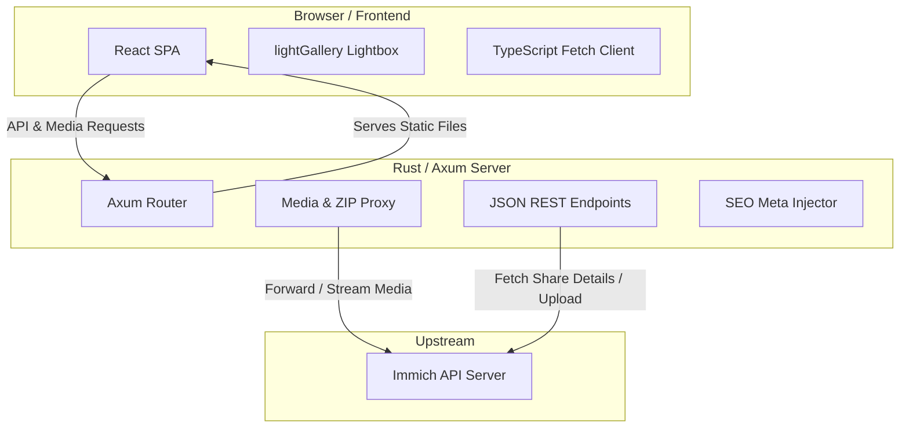
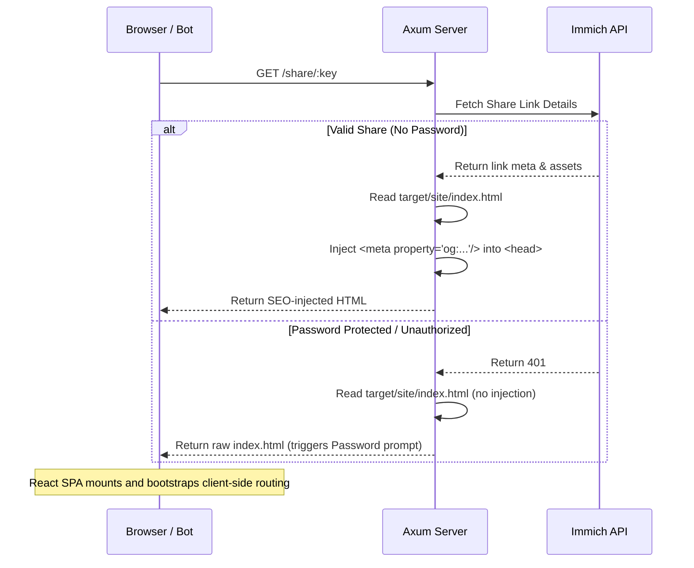
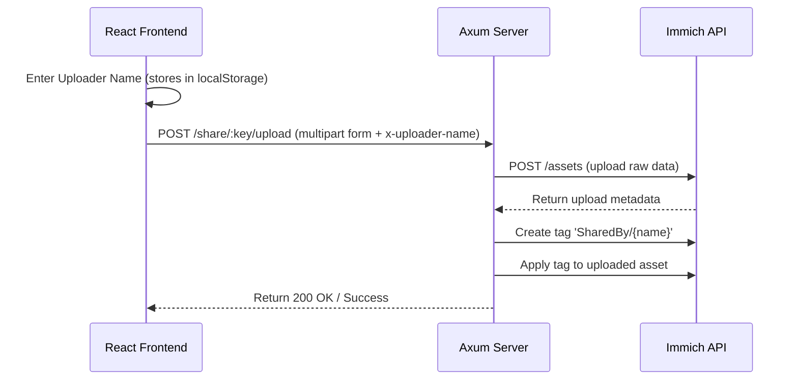

# Project Architecture Guide

This document explains the architecture, directory structure, data lifecycles, and type-safety mechanisms of the **immich-public-proxy-rs** project.

---

## 1. High-Level Architecture

The project consists of a stateless Rust backend (built with **Axum**) and a decoupled Single Page Application (SPA) frontend (built with **React, Vite, and TypeScript**).

The backend acts as a secure reverse proxy to your internal Immich instance. It serves the static frontend assets, handles JSON API requests, proxies media streams (with seeks/range requests), generates dynamic ZIP files for downloads, and injects SEO/OpenGraph preview tags on the fly.



---

## 2. Directory Structure

```
.
├── .github/workflows/          # GitHub actions (automated release builds)
├── assets/                     # Legacy/Original Leptos assets (frozen)
├── bindings/                   # (Cleaned up) temporary bindings folder
├── deploy.sh                   # Deployment script for copying binaries/assets
├── frontend/                   # Decoupled React frontend
│   ├── public/                 # Static assets (fonts, images, lightGallery)
│   ├── src/
│   │   ├── types/
│   │   │   └── generated/     # Generated TS types (DO NOT edit manually)
│   │   ├── App.tsx             # Core React app code & routing
│   │   ├── index.css           # Modular stylesheet (copied from style/main.css)
│   │   └── main.tsx            # React entry mount point
│   ├── package.json
│   ├── tsconfig.json
│   └── vite.config.ts          # Configured to build into ../target/site
├── src/                        # Rust backend source
│   ├── api/
│   │   ├── get_share_details.rs # Share details endpoint & helper logic
│   │   └── mod.rs
│   ├── immich_client/          # Upstream API client wrappers
│   │   ├── client.rs
│   │   ├── model.rs
│   │   └── mod.rs
│   ├── dto.rs                  # Data Transfer Objects (derived with ts-rs)
│   ├── main.rs                 # Axum server configuration & entry point
│   └── proxy.rs                # Photo/video/upload/download reverse proxy
├── style/                      # Rust styling sources (retained for backward compatibility)
└── target/site/                # Compiled static assets served by Axum
```

---

## 3. Core Lifecycles

### A. Page Load & SEO Meta-Tag Injection
When a request is made for `/share/:key` or `/s/:key`, the Axum backend intercepts the request, queries the metadata from Immich, and injects OpenGraph tags into `index.html` before sending it to the client. This allows rich preview cards in Slack, Discord, etc., without requiring full server-side rendering (SSR) of the SPA.



### B. Uploading Media
If the share link allows uploading, users can upload photos/videos. The client prompts for an uploader name (saved in `localStorage`), attaches it as a custom header (`x-uploader-name`), and sends files to `/share/:key/upload`. The backend proxies this to Immich using the upload service account API key (`IMMICH_API_KEY_UPLOAD_USER`), adds the assets to the album, and tags them with `SharedBy/{name}` in the background.



### C. Filter by Uploader (Frontend)
When an album has assets from multiple uploaders (i.e., ≥2 distinct `uploaderName` values), the frontend displays a settings gear button with a unified Settings modal. The modal contains a checkbox filter list showing each uploader's name and photo count (alphabetically sorted). Filtering is applied via `useMemo` before date-grouping and lightGallery index construction, so the lightbox, lazy loading, and grid all operate on the filtered set. Asset selection is independent of the filter — selected assets remain selected even when hidden by the filter. The filter state is ephemeral (not persisted to `localStorage`).

The Settings modal also houses the existing "Uploader Name" input when uploads are enabled, unifying both settings into one panel.

### D. ZIP Downloads
Downloads can be requested for the entire share or a custom selection of checkboxes. The backend handles this by streaming each asset from Immich on-the-fly and wrapping it into a compressed ZIP stream in real-time, avoiding large temporary disk usage.

---

## 4. Shared Type-Safety (Rust $\rightarrow$ TypeScript)

To prevent type drift between the Axum REST API and the React SPA, the project uses compile-time type codegen using **`ts-rs`**.

```
         [Rust Structs] (src/dto.rs)
                │
                │ #[derive(TS)]
                ▼
          (cargo test)
                │
                ▼
   [TypeScript Interfaces] (frontend/src/types/generated/)
                │
                ▼
         [React Client] (frontend/src/App.tsx)
```

### 1. Define Rust Struct
Any payload or model sent over the wire is declared in Rust with the `TS` trait:
```rust
#[derive(Serialize, Deserialize, TS)]
#[ts(export, export_to = "../frontend/src/types/generated/")]
pub struct SafeAsset {
    pub id: String,
    pub original_file_name: Option<String>,
    pub r#type: String, // "IMAGE" or "VIDEO"
    pub original_mime_type: Option<String>,
    pub file_created_at: Option<String>,
    pub width: Option<i32>,
    pub height: Option<i32>,
    pub uploader_name: Option<String>,
    #[serde(default)]
    pub uploader_is_fallback: bool,
    #[serde(skip_serializing)]
    #[ts(skip)]
    pub owner_id: Option<String>,
    pub download_url: Option<String>,
}
```

### 2. Export on Test Execution
Running `cargo test` executes the `ts-rs` runner, writing corresponding `.ts` interface declarations:
```typescript
// This file was generated by ts-rs. Do not edit this file manually.

export type SafeAsset = {
  id: string;
  originalFileName: string | null;
  type: string;
  originalMimeType: string | null;
  fileCreatedAt: string | null;
  width: number | null;
  height: number | null;
  uploaderName: string | null;
  uploaderIsFallback: boolean;
  downloadUrl: string | null;
};
```

### 3. Consume in TypeScript
The React application imports the generated types directly, ensuring compile-time validation:
```typescript
import type { SafeAsset } from './types/generated/SafeAsset';

function AssetTile({ asset }: { asset: SafeAsset }) {
  return <div>{asset.originalFileName}</div>;
}
```

---

## 5. Security & Performance Hardening

### HTML Escaping
All dynamic values injected into SSR meta tags (`og:title`, `og:description`, `og:image`, `og:url`, and their Twitter equivalents) are HTML-entity-escaped via a dedicated `html_escape()` function in `main.rs`. This prevents stored XSS from malicious album names or descriptions.

### Cookie Security
The `Secure` flag on password session cookies (`immich_pwd_*`) is conditional: it is set only when the incoming `X-Forwarded-Proto` header is `https`. This allows password-protected shares to work on plain HTTP deployments (common in LAN/Docker setups without TLS termination).

### MIME Passthrough
`SafeAsset` carries `original_mime_type` from Immich's upstream API. The frontend uses this for `<video>` elements instead of hardcoding a MIME type, ensuring correct playback for formats like `video/quicktime` (`.mov`).

### Content-Disposition
Download responses include both an ASCII fallback `filename="..."` and a UTF-8 `filename*=UTF-8''...` parameter, ensuring filenames with non-ASCII characters display correctly across all browsers.

### OnceLock Caching
Environment variables (`PUBLIC_BASE_URL`, `LEPTOS_SITE_ROOT`, `IMMICH_API_KEY_UPLOAD_USER`) and the shared `reqwest::Client` (with a 10-second connect timeout) are initialized once via `std::sync::OnceLock` and reused across requests.

### Bulk Tag Cache
The `get_or_create_tag` function in `proxy.rs` populates the tag cache with all tags from a single `/tags` API call, rather than scanning the full list per lookup. This reduces upload latency for albums with many tags/uploaders.

## 6. Development & Builds

### Running Locally
To run the proxy in development mode:
1. Start the React Vite dev server:
   ```bash
   cd frontend
   npm install
   npm run dev
   ```
2. In a separate shell, start the Rust Axum backend:
   ```bash
   IMMICH_URL=http://<immich-ip>:2283 IMMICH_API_KEY=<key> cargo run
   ```

### Production Bundling
Vite compiles the frontend assets directly to `target/site/`. Running the `deploy.sh` script or GitHub release workflow does the following:
```bash
# 1. Compile frontend static assets (Vite outDir is set to '../target/site')
(cd frontend && npm install && npm run build)

# 2. Build backend binary in release mode
cargo build --release
```
The resulting release binary (`target/release/immich-public-proxy-rs`) and static directory (`target/site/`) can be copied directly to your server.
